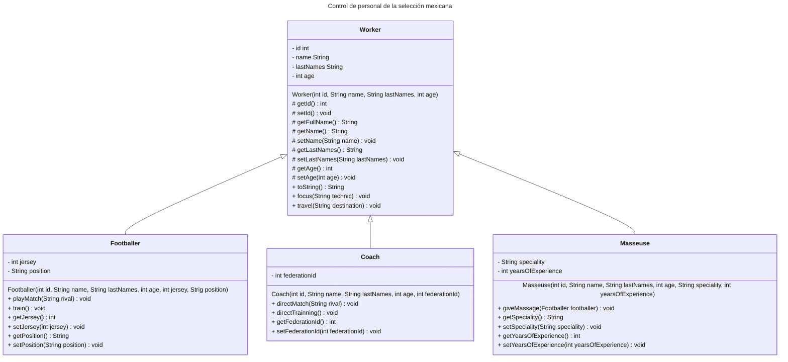

# Actividad 1. Convenciones y código limpio (clean code)

Programa para llevar el control del personal de la selección Mexicana de Futbol.

## Diagrama propuesto

```mermaid
---
title: Control de personal de la selección mexicana
---
classDiagram
    Worker <|-- Footballer
    Worker <|-- Coach
    Worker <|-- Masseuse

    class Worker {
        - id int
        - name String
        - lastNames String
        - int age
        Worker(int id, String name, String lastNames, int age)
        # getId() int
        # setId() void
        # getFullName() String
        # getName() String
        # setName(String name) void
        # getLastNames() String
        # setLastNames(String lastNames) void
        # getAge() int
        # setAge(int age) void
        + toString() String
        + focus(String technic) void
        + travel(String destination) void
    }
    
    class Footballer {
        - int jersey
        - String position
        Footballer(int id, String name, String lastNames, int age, int jersey, Strig position)
        + playMatch(String rival) void
        + train() void
        + getJersey() int
        + setJersey(int jersey) void
        + getPosition() String
        + setPosition(String position) void
    }

    class Coach {
        - int federationId
        Coach(int id, String name, String lastNames, int age, int federationId)
        + directMatch(String rival) void
        + directTrainning() void
        + getFederationId() int
        + setFederationId(int federationId) void 
    }

    class Masseuse {
        - String speciality
        - int yearsOfExperience
        Masseuse(int id, String name, String lastNames, int age, String speciality, int yearsOfExperience)
        + giveMassage(Footballer footballer) void
        + getSpeciality() String
        + setSpeciality(String speciality) void
        + getYearsOfExperience() int
        + setYearsOfExperience(int yearsOfExperience) void
    }

```
